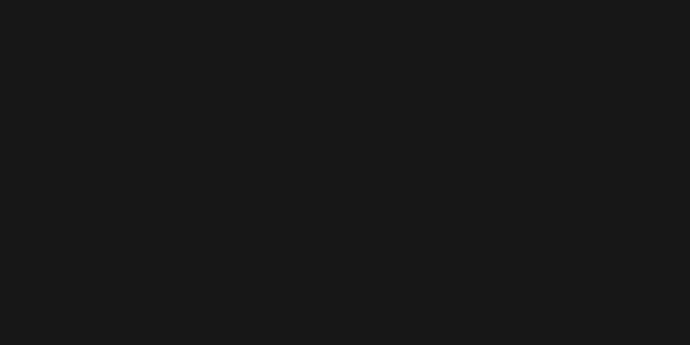
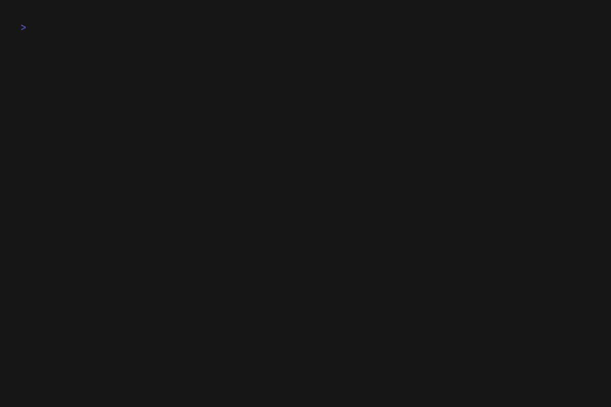

# Golem

[](https://go.dev/)
[](https://www.gnu.org/licenses/gpl-3.0)
[](http://makeapullrequest.com)

**Golem** is a lightweight, blazing-fast, and highly secure local file organizer CLI. Instead of relying on a slow, heavyweight AI agent framework to search and modify your filesystem, Golem leverages a hybrid architecture that keeps your files safe and perfectly organized using natural language.

<div align="center">
  
</div>

## ✨ Why Golem?

File organization is tedious, and typical AI agents are too risky and slow to unleash on your filesystem. Golem solves this via a secure hybrid approach:

1. **CLI**: A native, highly-optimized Go binary that securely handles all filesystem operations, path scoping, and collision prevention.
2. **LLM**: A local Ollama micro-model that acts purely as a natural-language-to-JSON parser—no hallucinated shell commands.
3. **Shell**: A vibrant, color-themed interactive REPL built with `go-prompt` to safely review and execute the generated organization plans.

> [!WARNING]
> **OS Compatibility:** Golem's interactive shell relies on `go-prompt` for native bash-like history and tab completion. This provides a flawless, premium experience on Linux and macOS, but may experience visual rendering issues on some native Windows terminals.

For our long-term vision and project history, check out our [Roadmap](docs/roadmap.md).

### See it in Action (Full Walkthrough)
Curious about the advanced interactive features, typo auto-correction, and sandbox-escape protection? Here's a full session recording:
<div align="center">
  
</div>

## 🚀 Installation

### 1. One-Line Install (Recommended)
Install the latest pre-compiled binary for your OS and architecture:
```bash
curl -fsSL https://raw.githubusercontent.com/toman92/golem-cli/main/install.sh | bash
```

### 2. Via Go (For Developers)
If you have Go installed, you can install the binary directly from source:
```bash
go install github.com/toman92/golem-cli/cmd/golem@latest
```

### 3. Build from Source
For manual installation or development:
```bash
git clone https://github.com/toman92/golem-cli.git
cd golem-cli
go mod tidy
go build -o golem ./cmd/golem
sudo mv ./golem /usr/local/bin/golem
```

## 📋 Prerequisites

Golem requires a local Ollama instance to act as its strict JSON parsing CLI. You can set this up in one of two ways:

### Option A: Docker Compose (Recommended)
If you don't have Ollama installed or want a clean, isolated environment, we provide a secure, pre-configured `docker-compose.yml`. It binds exclusively to `localhost` and uses an initialization sidecar to automatically pull the required micro-model (`qwen2.5-coder:1.5b`) for you.

```bash
docker compose up -d
```

### Option B: Bring Your Own Ollama
If you already have Ollama installed natively on your host, simply pull the recommended lightweight model:
```bash
ollama pull qwen2.5-coder:1.5b
```

### Basic Usage

You can start Golem in its interactive REPL mode by running it without arguments:

```bash
golem
```

Or, run a single task directly from your shell:

```bash
golem "Move all my downloaded PDFs into the documents folder"
```

For more detailed usage instructions, check out the [Usage Guide](USAGE.md).

## 🛡️ Architecture & Security

Golem implements a strict **Zero-Trust Sandbox Model**:
- **Sandboxed Execution:** Operations are strictly scoped to the user's specified root directory (current working directory by default).
- **Escape Detection:** Any attempt to modify files outside the sandbox triggers an explicit user confirmation prompt.
- **Destructive Operation Protection:** Certain destructive actions (like unrestricted `DELETE`) are hard-rejected by the CLI.
- **Collision Safety:** A SHA-256 hash-based collision detector ensures no data is inadvertently overwritten during a move or copy.
- **No Direct Shell Access:** The AI *never* executes commands. It only outputs a structured JSON execution plan (action, source, destination, patterns), which the Go binary evaluates.

## 📊 Observability

We strictly follow developer observability standards. The application logs all major actions securely to `~/.golem.log` using Go's structured `log/slog` package. This keeps standard output pristine for the interactive REPL while maintaining robust debugging traces.

## 🤝 Contributing

We welcome contributions! Please check out our [Contributing Guide](CONTRIBUTING.md) to learn how to set up the development environment, run tests, and submit pull requests.

## 🎥 Creating Demo Scripts (VHS)

We use [Charm VHS](https://github.com/charmbracelet/vhs) to generate high-quality GIF demonstrations of Golem's core features. The source `.tape` files are stored in the `demo/` directory.

To run demo scripts locally and regenerate the GIFs in a safe sandbox:
```bash
./demo/run_all.sh
```
This script rebuilds deterministic dummy files and runs VHS in a Podman container bound to the host network.

### Running Individual Tapes
If you just want to run a single tape (e.g. `demo/copy-safe.tape`) without regenerating everything, you can manually run the setup script and the VHS container:

```bash
# 1. Reset the dummy fixtures
./demo/setup_fixtures.sh

# 2. Run the specific tape
podman run --rm --network host -v $PWD:/vhs:z -v ./golem:/usr/bin/golem:z ghcr.io/charmbracelet/vhs demo/quick-demo.tape
```

*Note: Since the container mounts your local directory, any paths accessed in the demo must be resolvable from within the root of the project.*

## 📄 License

This project is licensed under the GNU General Public License v3.0 - see the [LICENSE](LICENSE) file for details.
